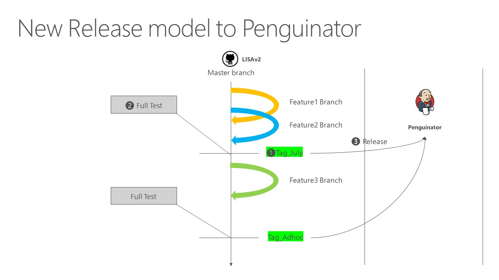

# Project Deployment/Release plan

## Objective and steps

This document describes about LISAv2 branch management and its release procedure. A release request can be made per time or feature base.

The change from feature branches will be merged to LISAv2 master branch. Based on standard software practice, feature branches will be merged to master via PR review process. Upon request of a release schedule, a new tag on master branch will be created. After passing all release readiness requirements including full validation and review, the code will be used by the production Jenkins pipelines.

1. Create a tag from the master branch in the format of 'stable-SPRINT'
2. Create a new Release from the new tag, named like 'stable-SPRINT'
3. Keep the branch along with older branches.
4. Replace 'stable' with the latest branch

## Support Contact

Contact LisaSupport@microsoft.com (Linux Integration Service Support), if you have technical issues.
