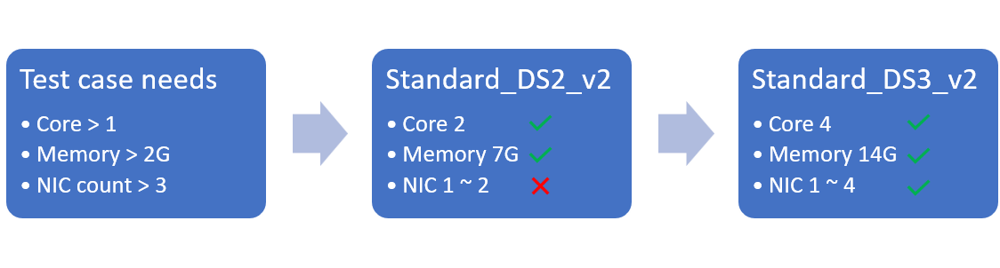

# Concepts

- [Runbook](#runbook)
- [Node and Environment](#node-and-environment)
- [Tools and Scripts](#tools-and-scripts)
- [Platform](#platform)
- [Feature](#feature)
- [Requirement and Capability](#requirement-and-capability)
- [Test suite and test case](#test-suite-and-test-case)

## Runbook

A runbook contains all the configurations of LISA operation, so it is called the runbook. With Runbook, the command line is very simply.

The previous version of LISA is powerful and supports many scenarios. But this increases the complexity of the command-line parameters and relies on a secret file. The current LISA provides a consistent way to manage configuration and maximize customization capabilities.

One runbook can refer to other runbooks so that test case selection, platform configuration and other options can be separated. It helps reduce duplication.

The runbook supports custom variables, and these variables can be provided in the runbook, command line or environment variables. Variables are only used in the runbook and are resolved to actual values before the start of the test.

The configuration of the runbook can be extended to certain components. For example, when defining a notifier, you can define its configuration structure together. The corresponding configuration will be loaded into the notifier with the same schema. The extended configuration also supports variables.

## Node and Environment

A node is the system under test, usually a virtual machine in a virtualization platform, but it can also be a physical computer. LISA can be further customized to support other types of nodes.

The environment includes one or more nodes and how they are connected. For example, certain Hyper-V tests need to be run on two hosts. This information is not within the scope of the node and is described at the environmental level.

## Tools and Scripts

Tools are runnable commands in a node. Scripts are considered tools. The only difference is that the tool is installed in many ways, but the script is uploaded to a node.

In different Linux distributions, tools may have different installation methods, commands, or command line parameters. The LISA tool provides a simple test interface. Therefore, the test focuses on verifying logic and does not need to deal with the diversity of distributions.

A collection of tools are provided on each node. After the tool is initialized, it will be added to the collection, and will be available during the lifetime of the node.

## Platform

The platform provides a test environment, such as Azure, Hyper-V or WSL. The platform will measure test requirements, deploy the environment and delete the used environment.

In most cases, after the environment is deployed, it has nothing to do with the source platform. In this way, tests from different platforms can be run in a consistent manner.

## Feature

The feature is like the tool, but it supports operations outside the node. For example, get serial logs of nodes, add disks, etc.

When implementing a platform, it also needs to implement supporting features. After a feature is implemented, the test cases that requires this feature, can be run on the platform.

## Requirement and Capability

A test case may have certain requirements for the test environment. For example, it may require two nodes, four CPU cores, serial logging, a certain Linux distribution or other. When writing test cases, the requirements of the test cases will be defined.

The platform provides environments with different capability. The capabilities of environments are loaded from the platform's API.

If the capability of an environment meets the requirements of a test case, the test case can be run on this environment.

For example, in the figure below. A test case requires at least one core, 2G memory and three network interface cards (NIC). The Azure VM size Standard_DS2_v2 meets the first two requirements, but can only have two NICs at most, so it does not meet the requirements of the test case. Standard_DS3_v2 supports up to four NICs, so it meets the requirements.

## Test suite and test case

A test suite contains one or more test cases that focus on certain functions or tested domains. A test case is the smallest unit that runs and generates test results.

The test cases in the same test suite have the same overall description and setting/clearing method. Each test case describes its own steps and sets the appropriate priority.

Test suites and test cases have their metadata. The metadata includes the description, priority, test requirement, and other information.
