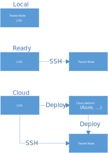

Introduction
============

**LISA** can be used to run test against the local node, or a remote node; if it
is used to run against a remote node, you don't need to configure anything on
the remote node.

Prerequisites
-------------

**LISA** can be launched on a Windows or a Linux OS. It needs to be installed on
a computer which has network access to the platform and the node to be tested.

-  It is recommended that this computer at least has 2 CPU cores and 4GB
   memory.

Installation
------------

Follow the installation guide below to install **LISA** on your OS.

-  :doc:`Use docker image on Linux <docker_linux>`
-  :doc:`Use docker image on Windows <docker_windows>`
-  :doc:`Installation on Linux <installation_linux>`
-  :doc:`Installation on Windows <installation_windows>`

Run tests
---------

Follow :doc:`Getting started with Azure <run_test/quick_run>` to quickly run
your first test. See :doc:`Run LISA <run_test/run>` for more detailed
information.

Write tests
-----------

See :doc:`Info for developers <write_test/write>` for more detailed information.

FAQ and Troubleshooting
-----------------------

If there is any problem, please refer to the :doc:`FAQ and troubleshooting
<troubleshooting>`.

Contribute
----------

You are very welcome to contribute. Please follow :doc:`the contribution
document <contributing>` for details.
