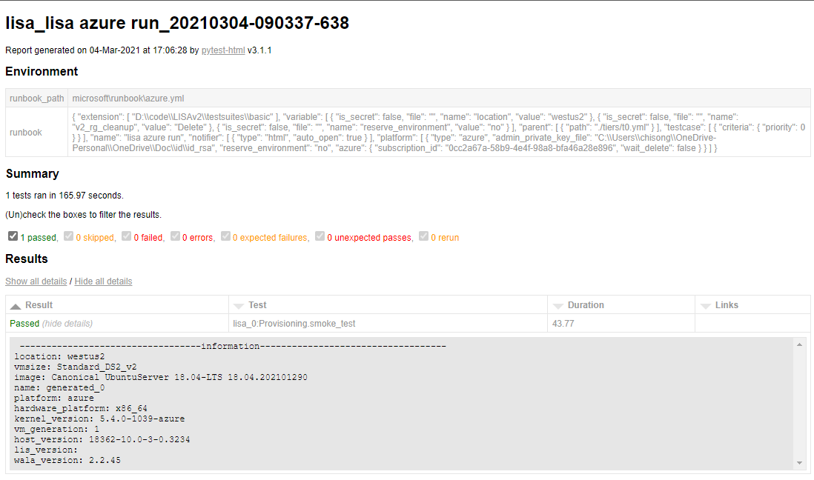

# Getting started with Azure

In this document we will guide you through the test procedure using a powerful
cloud computing service [Azure](https://azure.microsoft.com/). Follow the steps
below to configure your local computer and run LISA test against Linux VM on
Azure.

1. ### Sign in to Azure

    Make sure either [Azure
    CLI](https://docs.microsoft.com/en-us/cli/azure/install-azure-cli) or [Azure
    PowerShell](https://docs.microsoft.com/en-us/powershell/azure/install-az-ps)
    has been installed on your local computer. Then log in to your Azure
    subscription to authenticate your current session. LISA also supports other
    Azure authentications, for more information, please refer to [runbook
    reference](runbook.md).

    Here, let's choose `Azure CLI` for the setup. You should see a page pop up
    and all your Azure subscriptions shown in console after running the
    following command.

    ```bash
    az login
    ```

2. ### Get the subscription ID

    A subscription ID is a unique identifier for your server. LISA needs to know
    the Azure subscription ID for your testing. Run below command to retrieve
    subscription information.

    ```bash
    az account show --subscription "<your subscription Name>"
    ```

    You should get something in the following format. For now you only need the
    `<subscription id>` for future use.

    ```json
    {
        "environmentName": "AzureCloud",
        "homeTenantId": "<tenant id>",
        "id": "<subscription id>",
        "isDefault": true,
        "managedByTenants": [],
        "name": "<subscription name>",
        "state": "Enabled",
        "tenantId": "<tenant id>",
        "user": {
            "name": "<user account>",
            "type": "user"
        }
    }
    ```

    Note AzureCloud in this example is set to default, but you do not need to do
    that as long as you provide the correct Azure subscription ID.

3. ### Prepare SSH key pair

    LISA connects to the Azure test VM by SSH with key authentication; please
    have your key pair (public key and private key) ready before running the
    test. If you don't have a key pair, run below command to create a new one.

    ```bash
    ssh-keygen
    ```

    :warning:   Don't use passphrase to protect your key. LISA doesn't support
    that.

4. ### Run LISA

    Use above `<subscription id>` and `<private key file>` to run LISA with the
    default [runbook](runbook.md). It might take several minutes to complete.

    ```bash
    lisa -r ./microsoft/runbook/azure.yml -v subscription_id:<subscription id> -v "admin_private_key_file:<private key file>"
    ```

5. ### Verify test result

    After the test is completed, you can check the LISA console log, or the html
    report file for the test results. Refer to [Understand test
    results](understand_results.md) for more detailed explanation of the logs
    and report. See an example html report as below:

    

## See [Run LISA](run.md) for more advanced usages.
