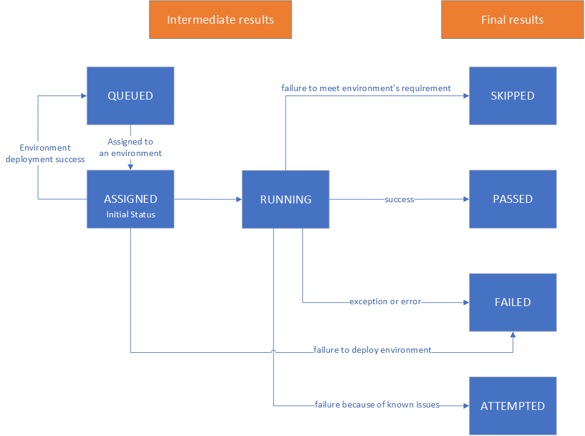

Troubleshoot Test Failures
===========================

-  `Overview <#overview>`__
-  `Analyze Test Results <#analyze-test-results>`__
-  `Log Files <#log-files>`__
-  `Search LISA Code for Issues <#search-lisa-code-for-issues>`__
-  `Reproduce Failures Manually <#reproduce-failures-manually>`__

Overview
-----------

To understand a test failure, follow these recommended troubleshooting
steps:

   1. **Analyze Test Results**: Look for the error messages in the
      console output. These messages are derived from assertion or
      exception messages and are the easiest and fastest way to
      understand a test failure.
   2. **Check the Log Files**: Search the root log file, which contains
      traces and command outputs, as well as the split log files, which are
      smaller in size.
   3. **Search the LISA Code for Issues**: Investigate the LISA codebase to
      identify potential issues.
   4. **Reproduce the Failure Manually**: Deploy the necessary resources
      and run the commands to try to reproduce the failure manually.

These steps are ranked in order of ease and speed of resolution. The
first two steps are the easiest and fastest to follow and should be
sufficient to resolve most issues. The last two steps are more advanced
and require more effort but can be useful for complex issues. It is
recommended to start with the first steps as they are lower in cost
compared to the later steps.

Analyze Test results
--------------------

- **Console Output**

The results of a test run are displayed in the console at conclusion of a
test run and saved in log files generated by LISA.  The console will
display a summary, containing the test suite and case name, test status
and a message if applicable.  There will be a summary generated that
tallies results of all tests results  Failures are categorized by similar messages.

.. figure:: ../img/test_results_summary.png
   :alt: test_results_summary

In the above example, there are 5 total tests run, with test results of
2 PASSED and 3 SKIPPED. The SKIPPED tests failed to meet requirements
for the test environment, due to an insufficient number of nodes and an
OS type mismatch, as stated in the message column.  See "Final
Results" below for more information on the meaning of PASSED and SKIPPED
results.

- **Test Result Categories**

It's essential to understand the results after running tests. LISA has 7
kinds of test results in total: 3 of which are intermediate results, and
4 of which are final results, as explained in sections below. Each test
case can and will be moved from one result to another but can never have
two or more results at the same time.

- **Final results**

A final result shows information of a terminated test. It provides more
valuable information than the intermediate result. It only appears in
the end of a successful test run.

  -  **FAILED**

     FAILED tests are tests that did not finish successfully and
     terminated because of failures like ``LISA exceptions`` or
     ``Assertion failure``. You can use them to trace where the problem
     was and why the problem happened.

  -  **PASSED**

     PASSED tests are tests that passed, or at least partially passed,
     with a special ``PASSException`` that warns there are minor errors in
     the run but they do not affect the test result.

  -  **SKIPPED**

     SKIPPED tests are tests that did not start and would no longer run.
     They suggest failure to meet some requirements in the environments
     involved with the test.

  -  **ATTEMPTED**

     ATTEMPTED tests are a special category of FAILED tests because of
     known issues, which are not likely to be fixed soon.

- **Intermediate results**

An intermediate result shows information of an unfinished test. It will
show up when a test changes its state. If a test run terminates because
of error or exception prior to running a test case, only the
intermediate result will be provided.

  -  **QUEUED**

     QUEUED tests are tests that are created, and planned to run (but have
     not started yet). They are pre-selected by extension/runbook
     criteria. You can check log to see which test cases are included by
     such criteria. They suggest that there are some tests waiting to be
     performed.

     QUEUED tests will try to match every created environment. They will
     move forward to ASSIGNED if they match any, and to SKIPPED if they
     match none of the environments.

  -  **ASSIGNED**

     ASSIGNED tests are tests that are assigned to an environment, and
     will start to run, if applicable, once the environment is
     deployed/initialized. They suggest some environmental setting up is
     going on.

     ASSIGNED tests will end with FAILED if the environment fails to
     deploy. Otherwise, they move forward to RUNNING. They will also move
     backward to QUEUED if the environment is deployed and initialized
     successfully.

  -  **RUNNING**

     RUNNING tests are tests that are in test procedure.
     RUNNING tests will end with one of the following final results.

Log Files
--------------------

After a test run, the LISA log file will be generated. The log file can
be found in the `runtime/log` directory that is generated after test
runs.  Navigate sub-folders until you find the log with a timestamp
corresponding to the time of the test run.  Inside the log's timestamped
folder, the contents are further split by environment and test case.
If the test run only has a few cases, the full log (`lisa-<timestamp>.log`)
may be easier to read. If it is run with concurrency, the split logs may
be easier to read.

- **LOG FOLDER STRUCTURE**

  * **environment** folder, which contains logs split for the
    environment.
  * **tests** folder, which contains logs split for the test cases.
  * **lisa.html** A formatted summary of test results. It can be viewed
    by opening the file in a web browser.
  * **lisa-<timestamp>.log** A full log of the test run. It contains all
    the information about the test run, including the test cases,
    environments, and results.

.. figure:: ../img/log_dir_structure.png
   :alt: log_dir_structure

-  **LOG FILE SEGMENTS**

  Each line (log entry) in the log file contains the following segments
  from left to right:

  * **timestamp** The timestamp corresponding to log entry
  * **thread number** The thread number of the log entry
  * **log level** The log level of the log entry
  * **component level** The component level provides the source of log entry

.. figure:: ../img/log_file_segments.png
   :alt: log_file_segments

-  **REMOTE COMMANDS LOGS**

  LISA logs all the commands executed on the remote machine.  The
  commands are logged in the **lisa-<timestamp>.log** file, unless it
  is too long.  Each command has a random id that is used to collocate
  async command outputs.  Previous output may be reused, so check the
  environment log to get previous output.  The commands are logged in
  the following format:

  * **Command line info** The command line that was executed
  * **stdout** The standard output of the command
  * **exit info** The exit code of the command

.. figure:: ../img/remote_command_output.png
   :alt: remote_command_output

-  **ENVIRONMENT LOGS**

  The environment logs are ordered by timestamp.  An environment may
  have multiple nodes.

.. figure:: ../img/environment_logs.png
   :alt: environment_logs

-  **SERIAL CONSOLE LOGS**

  The serial console logs are for the Azure platform.  Use the name
  column from the environment_stats.log to locate the proper
  environment folder.  The serial console log will be uploaded when the
  guest is in a bad state.

.. figure:: ../img/serial_console_logs.png
   :alt: serial_console_logs

-  **TEST RESULT LOGS - SPLIT BY CASE**

  The test folder may contain more logs, split by test case.  If so, a
  folder with in the format <timestamp>-<testcase> will be created, that
  containes log files named <timestamp>-<testcase>.log.

.. figure:: ../img/test_case_logs.png
   :alt: test_case_logs

Search LISA Code for Issues
----------------------------

If the test results and logs do not provide enough information to
resolve the issue, you may need to investigate the LISA codebase itself.
Use the stack trace information from the console output or logs to
locate the relevant code lines. Here’s how you can do it:

1. **Locate the Stack Trace**: Find the stack trace in the console
   output or in the log files located in the `runtime/logs` directory.
   The stack trace will show the sequence of function calls that led to
   the error.

2. **Identify Relevant Code Lines**: The stack trace includes file names
   and line numbers where the error occurred. Use this information to
   navigate to the corresponding lines in the LISA codebase.

3. **Understand the Flow**: Examine the functions and methods mentioned
   in the stack trace to understand the flow of execution. This will
   help you identify where the issue might be originating from.

4. **Search for Issues**: Look for any anomalies or potential issues in
   the code around the lines mentioned in the stack trace. This could
   include incorrect logic, unhandled exceptions, or other bugs.

5. **Contribute Back**: If you find areas that can be improved or
   clarified, consider contributing back to LISA to help others
   understand the issue through better error messages or code
   improvements.

Reproduce Failures Manually
---------------------------

If the test results and logs do not provide enough information to
resolve the issue, you may need to reproduce the failure manually. Set
up your development environment as described in the :doc:`Development Setup<../write_test/dev_setup>`.
Deploy the necessary resources, such as virtual machines or cloud
services. Try running the commands that caused the test failures and
observing output.  Be aware that reproducing failures can incur costs,
especially in cloud environments, so monitor your resource usage and
clean up resources when no longer needed. Some issues may not be
reproducible 100% of the time, so examining error messages and logs
might be more effective. If you manage to reproduce the issue or find a
solution, consider contributing back to LISA by improving error
messages, updating documentation, or fixing bugs to help others who
might encounter similar issues.

.. tip::
   **Quick Debugging with Early Exit**: When troubleshooting specific test failures,
   you can add ``exit_on_first_failure: true`` to your runbook configuration. This
   will stop test execution immediately after the first failure, saving time and
   resources by avoiding unnecessary test runs. See the
   :doc:`runbook reference <runbook>` for more details.
