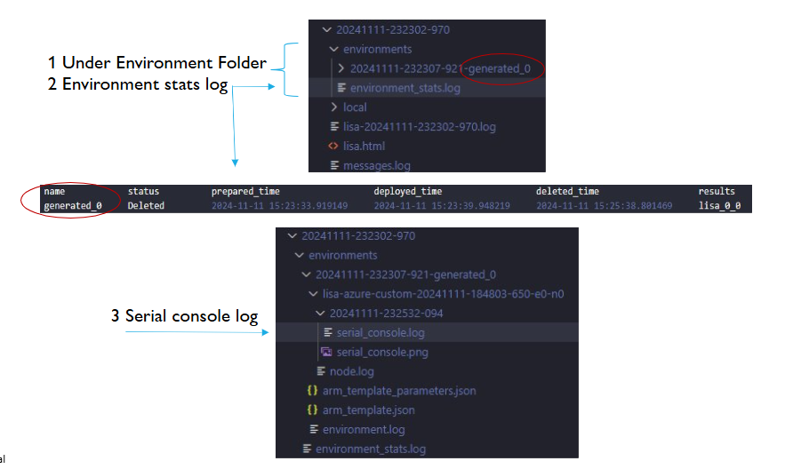

Troubleshoot Test Failures
=======================

-  `Overview <#overview>`__
-  `Test results <#test-results>`__
-  `Console output <#console-output>`__
-  `Log Folder Structure <#log-folder-structure>`__

Overview
--------

To understand a test failure, the recommended troubleshooting path is: 

   1. Check the test result error messages in console output.
   2. Check the log file.  Search the root log file which contains traces and commands output, as well as the split log files which are smaller in size.
   3. Search the LISA code for issues.
   4. Try to reproduce failure manually, deploy and run resources.

Test results
------------

It's essential to understand the results after running tests. LISA has 7
kinds of test results in total: 3 of which are intermediate results, and
4 of which are final results, as explained in sections below. Each test
case can and will be moved from one result to another but can never have
two or more results at the same time.

.. figure:: ../img/test_results.png
   :alt: test_results

- **Intermediate results**

An intermediate result shows information of an unfinished test. It will
show up when a test changes its state. If a test run terminates because
of error or exception prior to running a test case, only the
intermediate result will be provided.

  -  **QUEUED**
     QUEUED tests are tests that are created, and planned to run (but have
     not started yet). They are pre-selected by extension/runbook
     criteria. You can check log to see which test cases are included by
     such criteria. They suggest that there are some tests waiting to be
     performed.

     QUEUED tests will try to match every created environment. They will
     move forward to ASSIGNED if they match any, and to SKIPPED if they
     match none of the environments.

  -  **ASSIGNED**
     ASSIGNED tests are tests that are assigned to an environment, and
     will start to run, if applicable, once the environment is
     deployed/initialized. They suggest some environmental setting up is
     going on.

     ASSIGNED tests will end with FAILED if the environment fails to
     deploy. Otherwise, they move forward to RUNNING. They will also move
     backward to QUEUED if the environment is deployed and initialized
     successfully.

  -  **RUNNING**
     RUNNING tests are tests that are in test procedure.
     RUNNING tests will end with one of the following final results.

- **Final results**

A final result shows information of a terminated test. It provides more
valuable information than the intermediate result. It only appears in
the end of a successful test run.

  -  **FAILED**
     FAILED tests are tests that did not finish successfully and
     terminated because of failures like ``LISA exceptions`` or
     ``Assertion failure``. You can use them to trace where the problem
     was and why the problem happened.

  -  **PASSED**
     PASSED tests are tests that passed, or at least partially passed,
     with a special ``PASSException`` that warns there are minor errors in
     the run but they do not affect the test result.

  -  **SKIPPED**
     SKIPPPED tests are tests that did not start and would no longer run.
     They suggest failure to meet some requirements in the environments
     involved with the test.

  -  **ATTEMPTED**
     ATTEMPTED tests are a special category of FAILED tests because of
     known issues, which are not likely to be fixed soon.

Console Output
--------------------

The results of a test run are displayed in the console and saved in log
files generated by LISA.  The console will display a summary at the end
of each run, containing the test suite and case name, test status and a
message if applicable.  There will be a summary generated that tallies
results of all tests.

The test result message is the easiest, fastest way to understand a test
failure.  It is derived from assertion or exception messages.  Failures
are categorized by similar messages.

Log Folder Structure
--------------------

After a test run, the LISA log file will be generated. The log file can
be found in the `runtime/log` directory that is generated after test
runs.  Navigate subfolders until you find the log with a timestamp
corresponding to the time of the test run.  Inside the log's timestamped
folder, the contents are further split by environment and test case. The
logs will show INFO and above levels by default.

- **LOG FOLDER CONTENTS** 

  * **environment** folder, which contains logs split for the
    environment.
  * **tests** folder, which contains logs split for the test cases.
  * **lisa.html** A formatted summary of test results. It can be viewed
    by opening the file in a web browser.
  * **lisa-<timestamp>.log** A full log of the test run. It contains all
    the information about the test run, including the test cases,
    environments, and results.

-  **LOG FILE SEGMENTS**
  
  Each line (log entry) in the log file contains the following segments
  from left to right: 
  
  * **timestamp** The timestamp corresponding to log entry 
  * **thread number** The thread number of the log entry 
  * **log level** The log level of the log entry 
  * **component level** The component level provides the source of log entry

.. figure:: ../img/log_file_segments.png
   :alt: log_file_segments

-  **REMOTE COMMANDS LOGS**

  LISA logs all the commands executed on the remote machine.  The
  commands are logged in the **lisa-<timestamp>.log** file, unless it
  is too long.  Each command has a random id that is used to collocate
  async command outputs.  Previous output may be reused, so check the
  environment log to get previous output.  The commands are logged in
  the following format: 
  
  * **Command line info** The command line that was executed 
  * **stdout** The standard output of the command 
  * **exit info** The exit code of the command

.. figure:: ../img/remote_command_output.png
   :alt: remote_command_output

-  **ENVIRONMENT LOGS**
  
  The environment logs are ordered by timestamp.  An environment may
  have multiple nodes.

-  **SERIAL CONSOLE LOGS**
  
  The serial console logs are for the Azure platform.  Use the name
  column from the environment_stats.log to locate the proper
  environment folder.  The serial console log will be uploaded when the
  guest is in a bad state.

-  **TEST RESULT LOGS - SPLIT BY CASE**

  The test folder may contain more logs, split by test case.  If so, a
  folder with in the format <timestamp>-<testcase> will be created, that
  containes log files named <timestamp>-<testcase>.log.

